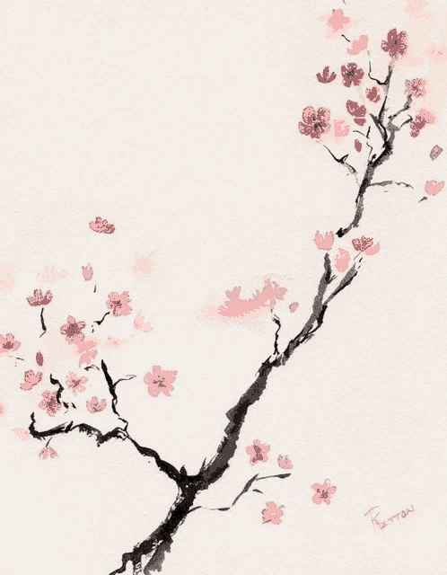

# Kaleb

## About Me

👨‍💻 Electronics/Telecom Engineer passionate about ARM, FPGA, RF, SDR, DSP (especially video), streaming, and cybersecurity (pentest, hardware hacking). Experienced in Infrastructure/DevOps/Platform engineering with a focus on observability, eBPF, and low-level systems.
I've been working with Web Development / Web Systems for a while but always keeping my eyes on other IT areas. Professionally I've worked with legacy systems and cutting-edge disruptive technologies, from Delphi and VB to IPFS and Serverless.

### Location 🌍

### My OS

### Tools and Tech

  
### Hobbies

